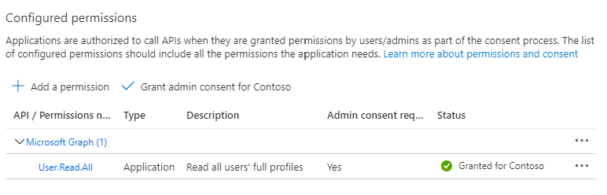

<!-- markdownlint-disable MD041 -->

In this section you will update the app registration from the previous section to support app-only authentication. You only need to complete this section if you intend to use the app-only portions of this tutorial. If not, you can safely skip to the next step.

> [!div class="nextstepaction"]
> [I don't need app-only, skip to the next step](?tutorial-step=3)

> [!IMPORTANT]
> The steps in this section require a work/school account with the Global administrator role.

### [Azure AD admin center](#tab/aad)

1. Open the app registration from the previous section in the Azure AD admin center.

1. Select **API permissions** under **Manage**.

1. Remove the default **User.Read** permission under **Configured permissions** by selecting the ellipses (**...**) in its row and selecting **Remove permission**.

1. Select **Add a permission**, then **Microsoft Graph**.

1. Select **Application permissions**.

1. Select **User.Read.All**, then select **Add permissions**.

1. Select **Grant admin consent for...**, then select **Yes** to provide admin consent for the selected permission.

    

1. Select **Certificates and secrets** under **Manage**, then select **New client secret**.

1. Enter a description, choose a duration, and select **Add**.

1. Copy the secret from the **Value** column, you will need it in the next steps.

    > [!IMPORTANT]
    > This client secret is never shown again, so make sure you copy it now.

### [PowerShell](#tab/powershell)

1. Create a new file named **UpdateAppForAppOnlyAuth.ps1** and add the following code.

    :::code language="powershell" source="../demo/UpdateAppForAppOnlyAuth.ps1" id="ScriptBody":::

1. Save the file.

1. Open PowerShell and change the current directory to the location of **UpdateAppForAppOnlyAuth.ps1**.

1. Run the following command, replacing *&lt;your-app-id&gt;* with the desired value (see table below).

    ```powershell
    .\UpdateAppForAppOnlyAuth.ps1 -AppId <your-app-id> -GraphScopes "User.Read.All"
    ```

1. Follow the prompt to open `https://microsoft.com/devicelogin` in a browser, enter the provided code, and complete the authentication process.

1. Copy the **Client secret** value from the script output. You will need this value in the next step.

    ```powershell
    SUCCESS
    Tenant ID: a795ad0f-7d82-4a3b-a2c0-0713ec72ade7
    Client secret: 2jv7Q~8eiOd_QafJ.....
    Secret expires: 2/16/2024 9:32:09 PM
    ```

---

> [!NOTE]
> Notice that, unlike in the previous section, in this section you did configure Microsoft Graph permissions on the app registration. This is because app-only auth uses the [client credentials flow](https://docs.microsoft.com/azure/active-directory/develop/v2-oauth2-client-creds-grant-flow), which requires that permissions be configured on the app registration. See [The .default scope](https://docs.microsoft.com/azure/active-directory/develop/v2-permissions-and-consent#the-default-scope) for details.
