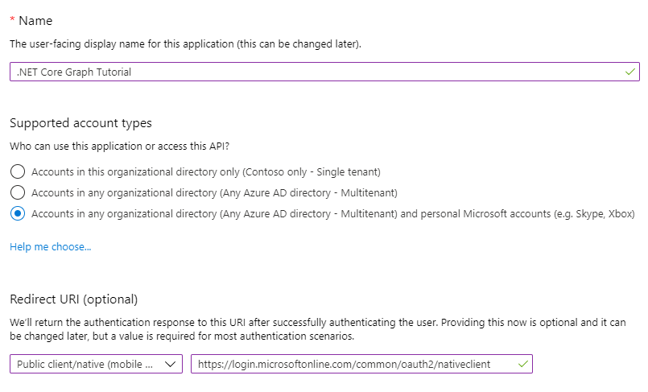
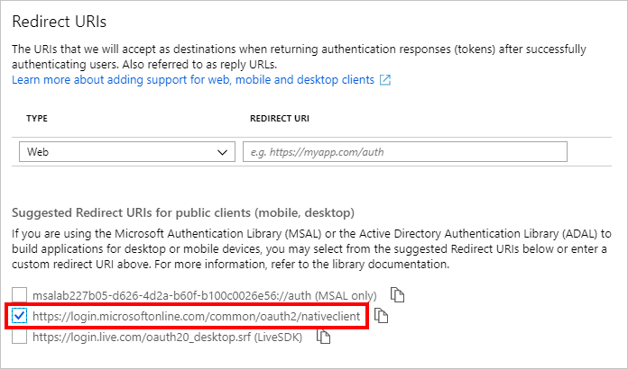

<!-- markdownlint-disable MD002 MD041 -->

In this exercise you will create a new Azure AD application using the Azure Active Directory admin center.

1. Open a browser and navigate to the [Azure Active Directory admin center](https://aad.portal.azure.com) and login using a **personal account** (aka: Microsoft Account) or **Work or School Account**.

1. Select **Azure Active Directory** in the left-hand navigation, then select **App registrations** under **Manage**.

    

1. Select **New registration**. On the **Register an application** page, set the values as follows.

    - Set **Name** to `.NET Core Graph Tutorial`.
    - Set **Supported account types** to **Accounts in any organizational directory and personal Microsoft accounts**.
    - Leave **Redirect URI** empty.

    

1. Select **Register**. On the **.NET Core Graph Tutorial** page, copy the value of the **Application (client) ID** and save it, you will need it in the next step.

    

1. Select the **Add a Redirect URI** link. On the **Redirect URIs** page, locate the **Suggested Redirect URIs for public clients (mobile, desktop)** section. Select the `https://login.microsoftonline.com/common/oauth2/nativeclient` URI.

    

1. Locate the **Default client type** section and change the **Treat application as a public client** toggle to **Yes**, then choose **Save**.

    
